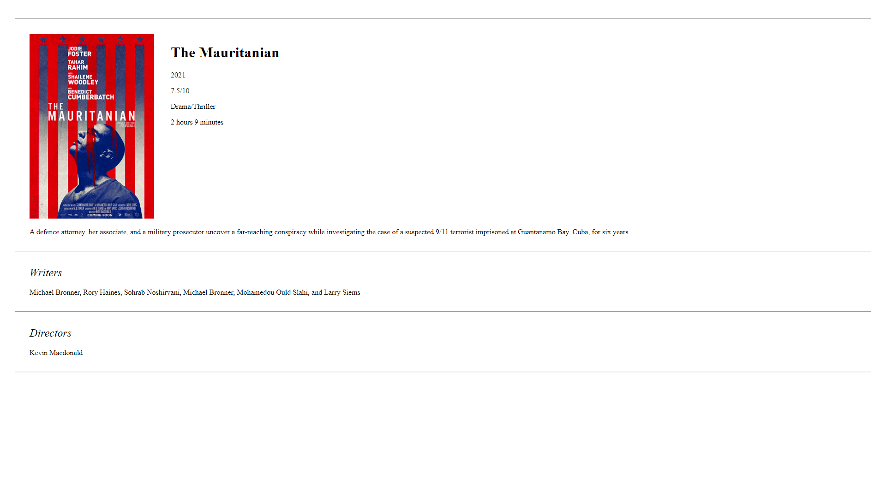

# Instructions

From

	https://developer.mozilla.org/en-US/docs/Learn/Common_questions/set_up_a_local_testing_server

To host a local web server, use

	python3 -m http.server

Then access it through

	localhost:8000

# Previews

## Main page

## Details page

